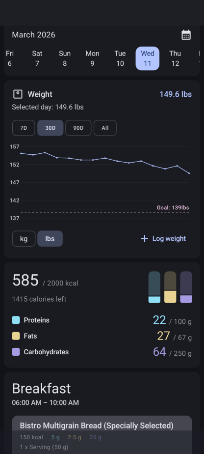

# FoodWeightYou

A fork of [**FoodYou**](https://github.com/maksimowiczm/FoodYou) - the free, open-source, privacy-focused food diary and nutrition tracker built with [Material Design](https://m3.material.io/) - that adds **daily weight tracking** right on your home screen.

### 🏋️ What's Different
This fork introduces a weight tracker card to Food You's modular home screen, so you can log and visualize your daily body weight alongside your meals and nutrition. Track what you eat *and* where it's taking you.

Everything else - the food databases, nutrition tracking, recipe creation, Material You theming - remains exactly as the upstream project intended. No other modifications have been made.

### 🔄 Database Compatibility
Already using FoodYou? No problem! FoodWeightYou can import your existing FoodYou database seamlessly. All your food logs, recipes, and settings carry over without a hitch.

### Credits
All credit for the original app goes to [Mateusz Maksimowicz](https://github.com/maksimowiczm) and the [Food You](https://github.com/maksimowiczm/FoodYou) project. If you find this useful, please consider [supporting the original developer](https://ko-fi.com/maksimowiczm) and giving the upstream repo a ⭐.

### 📜 License
This project inherits the [GNU General Public License v3.0](LICENSE) from the original Food You project.

 

 

